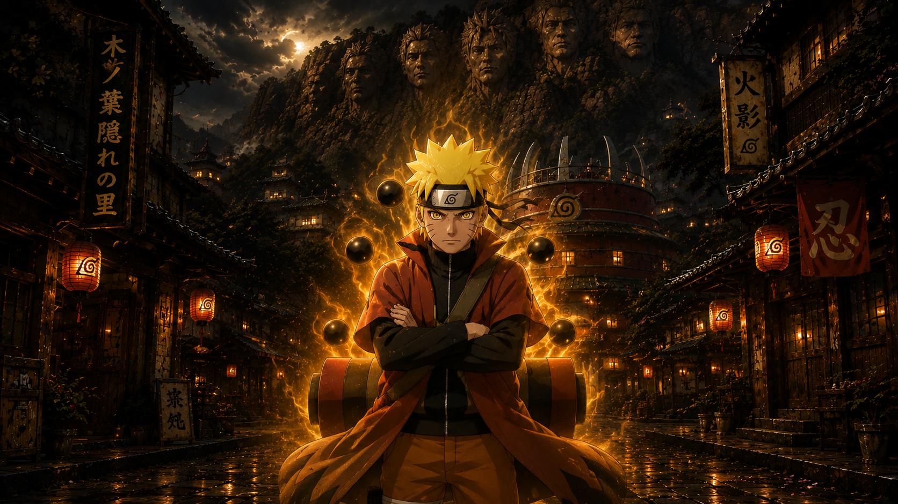
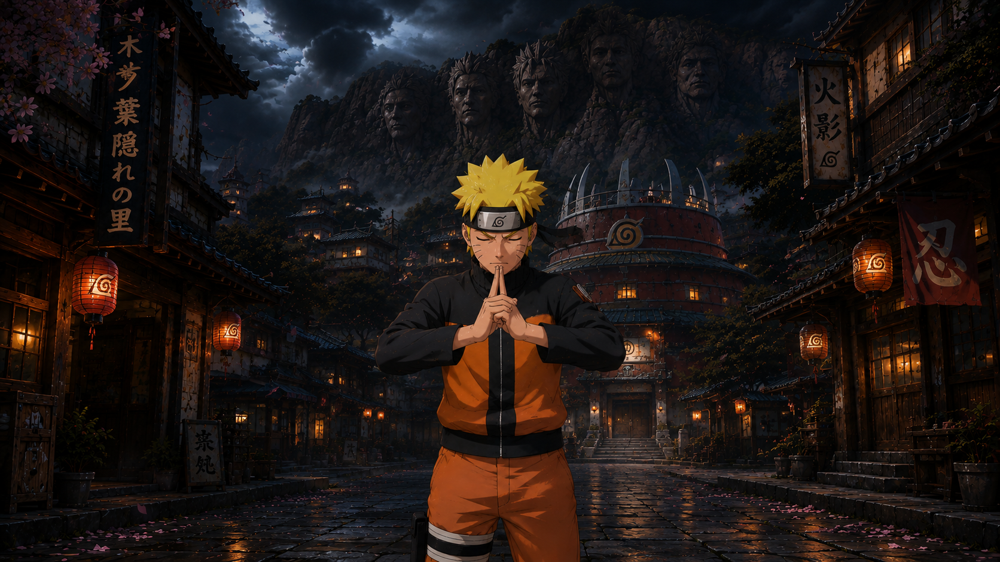
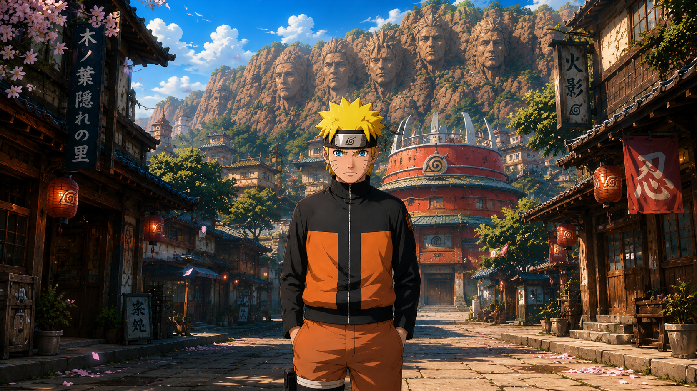

# Naruto — Sage Mode Awakening

An Awwwards-style single-page experience depicting Naruto's transformation from Base form → Hand Seal → Sage Mode. Features a cinematic preloader, video hero with electric ambience, and a pinned scroll-driven **thunder-crack transformation** with jagged lightning cracks, branching bolts, screen flashes, and camera shake.

Built with **vanilla HTML/CSS/JS + GSAP ScrollTrigger** — single file, no build step.

---

## 🎬 Preview

Open `index.html` in a browser (a local server is recommended so the video loads — see [Quick Start](#quick-start)). Scroll slowly through the transformation section to watch the sky answer.

---

## ✨ The Experience

| Stage | Description |
|-------|-------------|
| **Preloader** | Brush-stroke NARUTO wordmark stamps in with 仙人モード kanji, "SYNCING CHAKRA" counter fills, white flash cracks, loader wipes away |
| **Hero** | Fullscreen video under cinematic shade, giant "UZUMAKI / NARUTO" brush-font title (per-letter 3D stagger reveal, mouse parallax, electric letter flickers), vertical kanji rails, rising chakra particles, live HUD frame with clock & signal readout, ambient thunder flickers |
| **Bolt Divider** | Jagged lightning line that draws itself on scroll |
| **Transformation** | Pinned 360vh scroll section with 3 stacked images & 2 crack transitions:<br>• **Crack 1** (Base → Hand Seal): lighter jagged sweep, cyan crackle bolts — focused, quiet energy<br>• **Crack 2** (Hand Seal → Sage Mode): wilder crack, full-height branching thunder bolts, white flashes, camera shake on each strike<br>• Captions & mode badges swap per stage; HUD state: `BASE → FOCUSING → HAND_SEAL → DRAWING_NATURE_ENERGY → SAGE_MODE`; ambient motes shift volt-blue → green → warm orange |

**Awwwards staples included:** film grain overlay, custom cursor ring, `prefers-reduced-motion` support, mobile responsiveness.

---

## 🚀 Quick Start

Because the page loads a local video file, run it from a small local server rather than double-clicking (browsers block local video/CORS otherwise):

```bash
# From the project folder, any of these:
npx serve .
# or
python3 -m http.server 8000
```

Then open `http://localhost:8000` (or the port shown).

---

## 📁 Project Structure

```
naruto-sage-awakening/
├── index.html          # Everything: markup, styles, scripts (single file)
├── video/
│   └── hero.mp4        # Hero background video (replace with your own)
├── 1.png               # Base form (shown first)
├── 2.png               # Sage Mode (revealed last)
└── 3.png               # Hand Seal (middle stage)
```

---

## 🔧 Swapping Assets

### Hero Video
Place your file at `./video/hero.mp4`, or edit the `src` on the `<video>` tag (line ~189). If missing, an animated storm placeholder renders automatically so the page never breaks.

### Transformation Images
The three `` tags in the `.morph` section (lines 226–228):

```html
  <!-- revealed last -->
  <!-- middle stage -->
  <!-- shown first -->
```

**Important:** Use the **same aspect ratio and framing** for all three — they stack with `object-fit: cover`, so matched crops make the crack cuts look like one shot transforming.

### Logo & Badges
The preloader wordmark and three caption badges are base64-embedded PNGs. Replace the `src` data URIs to swap them.

---

## ⚙️ Tuning Parameters

| Parameter | Location | Default | Effect |
|-----------|----------|---------|--------|
| Scroll length | `.morph { height: 360vh }` | `360vh` | Shorter = faster transformation |
| Transition windows | `T1S/T1E/T2S/T2E` (JS) | `0.08–0.42`, `0.56–0.92` | When each crack plays within the scroll |
| Crack jaggedness | `offsets1` / `offsets2` multipliers | `*7` / `*11` | Higher = rougher crack edge |
| Strike frequency | `now - lastStrike > 150` | `150ms` | Lower = more bolts during crack 2 |
| Video darkness | `.hero__shade` gradient | 42–92% black | Raise alphas for darker hero |
| Thunder flicker rate | `setTimeout(ambientFlicker, 2600+…)` | ~2.6–6.8s | Ambient hero flashes |
| Video speed | `vid.playbackRate` | `1` | Set e.g. `0.75` for slow cinematic |
| Title parallax | `nx * 26, ny * 12` | 26/12px | Mouse-follow drift amount |

All tuning constants are near the top of the `<script>` block for easy access.

---

## ⚡ How the Crack Transition Works

Each image layer above the bottom one gets a live `clip-path: polygon(...)` — a vertical jagged line built from **22 points** with fixed random offsets plus a sine-wave jitter, so the edge crackles like live current. Scroll progress moves the cut left-to-right, erasing the layer to reveal the one beneath.

**Lightning bolts** are generated by **recursive midpoint displacement** (a straight line repeatedly split and kicked sideways) and drawn in two passes on a canvas:
1. Fat soft glow (rgba, 0.18 opacity)
2. Thin bright core (white, 0.95 opacity)

Fading over ~12 frames. Flashes and camera shake fire on each big strike.

---

## 🛠️ Tech Stack

| Technology | Purpose |
|------------|---------|
| **GSAP 3.12 + ScrollTrigger** (CDN) | Preloader timeline, scroll scrubbing, pinning, parallax |
| **Canvas 2D API** | Lightning bolts, chakra particles, motes, video fallback |
| **CSS `clip-path`** | Animated crack reveals |
| **Google Fonts** | Shojumaru (brush display), Anton, Space Mono, Shippori Mincho, Bebas Neue |

**No framework, no bundler.** Works in current Chrome, Edge, Firefox, and Safari. All motion respects `prefers-reduced-motion`.

---

## 📜 Credits & Licensing

- **Code:** Free to use and modify for your own projects.
- **Artwork & "Naruto" / characters:** Naruto is created by Masashi Kishimoto; all character art, video, and trademarks belong to their respective rights holders. The images and video here are **fan/demo assets** — replace them with content you have the right to use before publishing.
- **Kanji used:** 忍道を貫く (follow your ninja way), 仙人モード (Sage Mode) — standard Japanese; rendering depends on the system/browser CJK font stack.

---

> *I never go back on my word. That's my ninja way.* 🦊